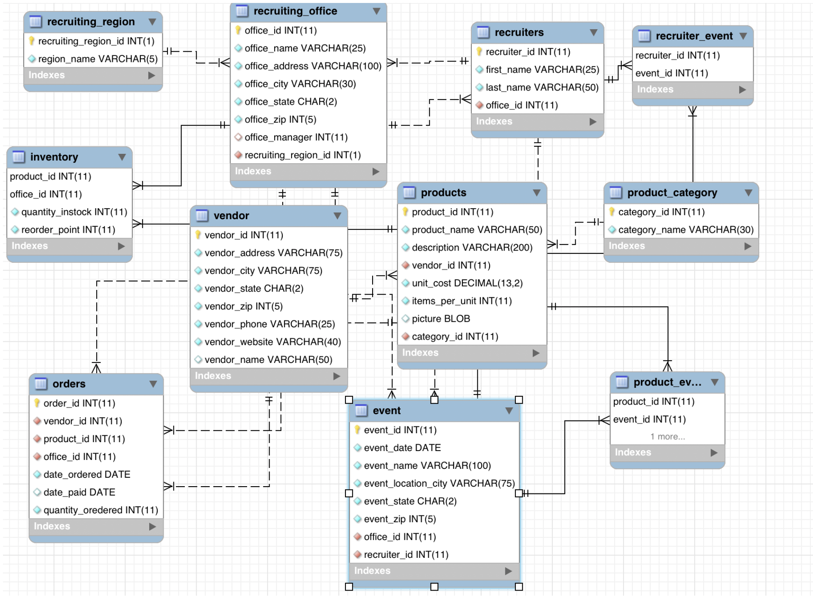
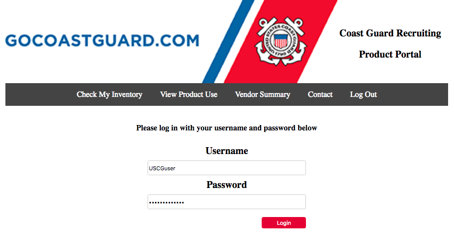
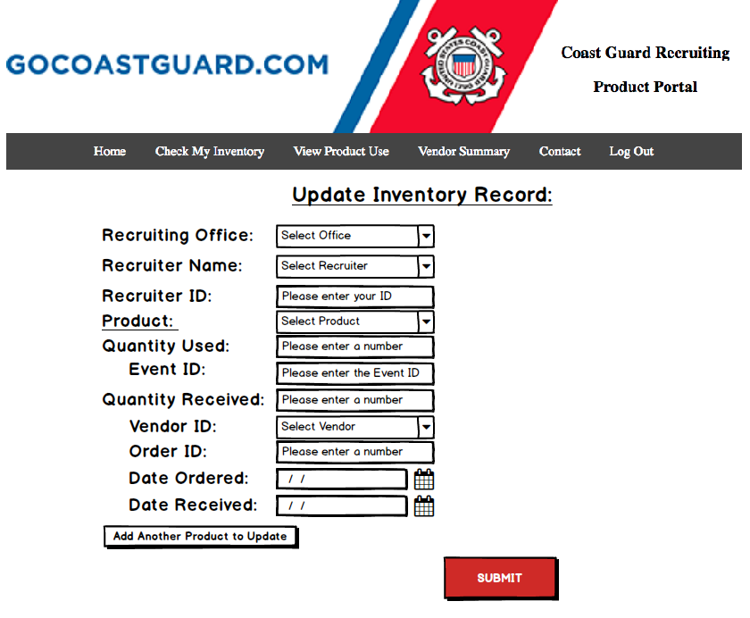
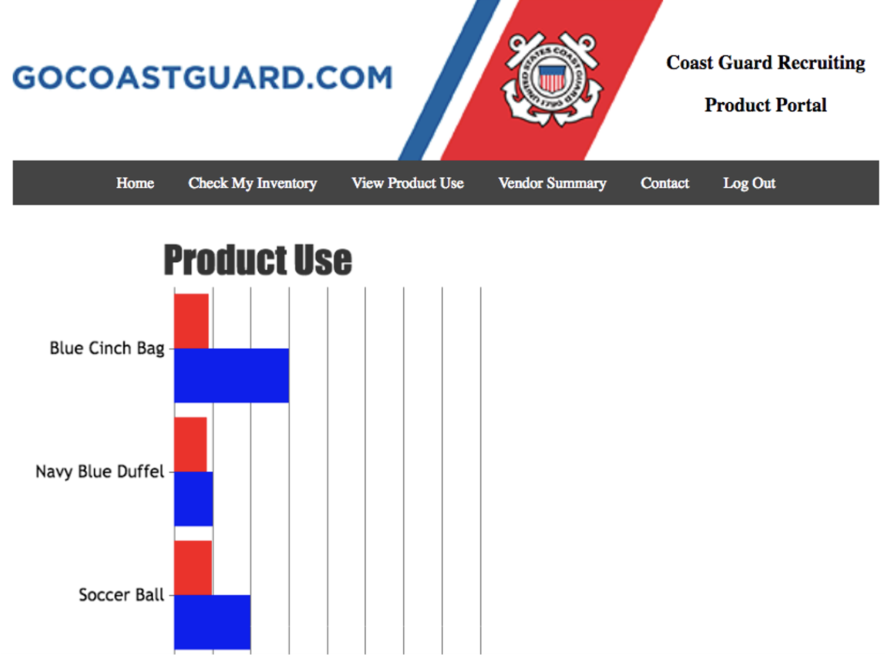

## USCG Product Portal - SQL Database and Web App

## Project Purpose: 
The Coast Guard Recruiting Command requested the design, development, and production of a functioning database and front-end web application that tracks CGRC promotional items inventory, ordering, and distribution to and from Coast Guard Recruiting Offices.  

## Business Case: 
The Coast Guard Recruiting Command (CGRC) is responsible for recruiting new individuals to join the US Coast Guard in many different roles and capacities.  During the recruiting process, many different CGRC-branded promotional items are used.  Promotional items are an integral part of the recruiting process because they contain valuable information about the Coast Guard and help to convey the Coast Guard’s mission, values, and brand to potential recruits.  Ultimately, the CGRC wishes to recruit individuals who will be successful in the Coast Guard, and the promotional items are a big part of achieving this goal.  Promotional items include items such as brochures about active duty or scholarships, apparel such as tee-shirts and baseball hats, and smaller items such as pens, pencils, or keychains.

## Client Needs: 
The Recruiting Command has no tool for tracking inventory of the various products used during recruitment activities.  Promotional items are maintained as inventory at each individual Coast Guard Recruiting Office and given out to potential recruits at events.  Maintaining enough inventory at each office has been a challenge due to disorganized inventory, inefficient ordering practices, insufficient planning for events, and lack of product diversity.  It is imperative that each recruiting office has enough of each promotional material needed for their events, yet promotional materials are frequently updated and trends change so any surplus needs to be minimized.  The CGRC, which oversees recruiting offices, needs a way to monitor promotional item inventory at, orders from, and distribution to each individual Coast Guard Recruiting Office.  The CGRC seeks a database that contains all data for the promotional items and a user-friendly application that allows them to use this data to track the ordering, inventory, and distribution of promotional items in the Coast Guard’s recruiting offices. 

## Existing Data: 
The following data exists and is organized by the CGRC, but will need to be compiled and organized into tables:
Recruiting Regions - Geographical areas
Recruiting Offices - Name, address, city, state, zip, manager, region
Recruiter - First name, last name, office, manager status
Product Categories - Category name
Products - Product name, description, vendor, unit cost, items per unit, photo
Inventory - Quantity in stock, minimum order quantity
Vendors - Name, address, city, state, zip, phone, website
Orders - Date ordered, date paid, quantity ordered, estimated delivery date
Events - Date, location, location address, office, recruiter(s), product(s), quantity of product(s) used

## Business Rules: 
The Coast Guard Recruiting command is organized into different geographical recruiting regions.  Within each of these regions, there are many recruiting offices, where each office is part of one and only one recruiting region.  Each recruiting office has many Coast Guard recruiters working in it, and each recruiter works for one and only one recruiting office.  

Each recruiting office has many different recruiting promotional items in its inventory at any given time.  These items are used throughout the recruiting process, and can include brochures, pens, tee-shirts, and other small items.  There are many different products in each recruiting office’s inventory, and these products are organized by product categories that contain many products of similar type.  For example, a category might be “apparel” and include tee-shirts, polo shirts, baseball hats, and sunglasses.  Each individual product can be part of only one product category.    

These products are obtained via many different orders through which the products are ordered and re-ordered as needed by recruiting offices.  The orders are through a vendor that sells the items.  

The products in a recruiting office’s inventory are used for events that are planned and hosted by recruiters.  Each recruiter has the option to plan many events, but it is not required that a recruiter plan an event.  Promotional items are given out at recruiting offices, but are primarily given out via recruiting events.  The recruiter(s) hosting that event plan what promotional items they would like to use at the event based on the event’s focus.   

## Deliverable: 
A database and front-end web app that end users can utilize to organize, view, update, and track the ordering, inventory, and distribution of promotional items in the Coast Guard’s recruiting offices.  Below are three pages and features of the web app.

Secure Login:

Update Inventory Form:

Product Use Visual:

## Skills Used: 
Databases - ERD with MySQL hosted on private server

SQL & MySQL - building, querying, viewing DB

PHP - create front-end web app accessing DB

UI Design - implementing value-add features for users

Security - maintaining security and confidentiality of govt data

Project Management - tracked progress with project plan, milestones, and Gantt chart

## In Repository:

Relational and ERD diagrams

SQL scripts  

Three web app views

Note: Due to personally identifiable data, some data, scripts, and files have been intentionally omitted.

